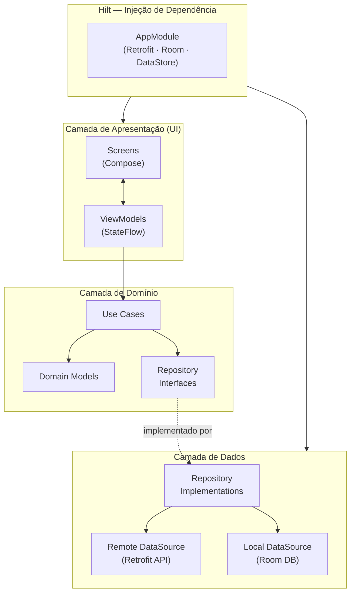
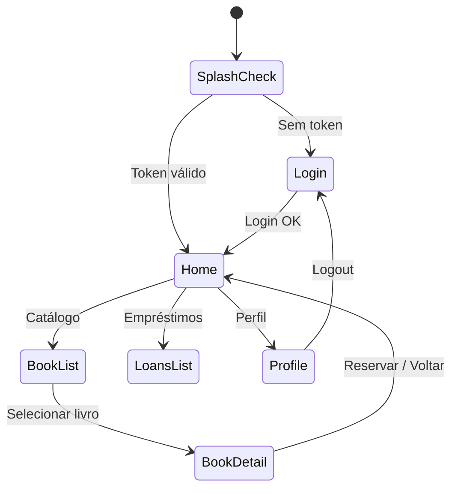

# BibliotecaPlus App

Aplicativo Android nativo da plataforma BibliotecaPlus — Kotlin + Jetpack Compose.

## Stack

- **Linguagem**: Kotlin
- **UI**: Jetpack Compose + Material3
- **Arquitetura**: MVVM + Clean Architecture
- **DI**: Hilt/Dagger
- **HTTP**: Retrofit + OkHttp
- **DB Local**: Room (offline-first)
- **Persistência**: DataStore (token JWT)
- **Imagens**: Coil
- **Navegação**: Navigation Compose

---

## Arquitetura Clean



---

## Fluxo de Navegação



---

## Estrutura do Projeto

```
app/src/main/java/com/bibliotecaplus/
├── di/                   → Hilt modules (AppModule)
├── data/
│   ├── api/              → Retrofit service + DTOs
│   ├── local/            → Room DAOs + entities
│   └── repository/       → Repository implementations
├── domain/
│   ├── model/            → Domain models
│   └── usecase/          → Use cases (Business logic)
└── presentation/
    ├── navigation/        → AppNavGraph
    ├── auth/              → LoginScreen + LoginViewModel
    ├── home/              → HomeScreen + HomeViewModel
    ├── books/             → BookListScreen · BookDetailScreen
    ├── loans/             → LoansScreen + LoansViewModel
    └── profile/           → ProfileScreen + ProfileViewModel
```

---

## Início Rápido

```bash
# 1. Abrir no Android Studio
# 2. Criar local.properties
echo "sdk.dir=$HOME/Library/Android/sdk" > local.properties

# 3. Build e deploy automático (detecta IP local)
chmod +x deploy-android.sh
./deploy-android.sh

# Ou build manual no Android Studio → Run 'app'
```

## Deploy com IP local (dispositivo físico)

```bash
./deploy-android.sh
# Detecta IP da rede local automaticamente
# Build APK apontando para http://<IP>:4000/api/v1/
# Instala via ADB se dispositivo conectado
```

## URL da API

| Ambiente | URL |
|----------|-----|
| Emulador | `http://10.0.2.2:4000/api/v1/` |
| Dispositivo físico | `http://<IP_LOCAL>:4000/api/v1/` |
